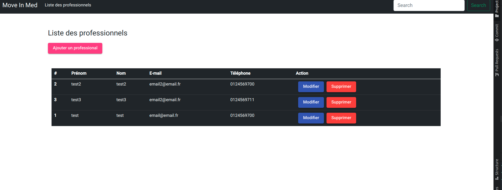
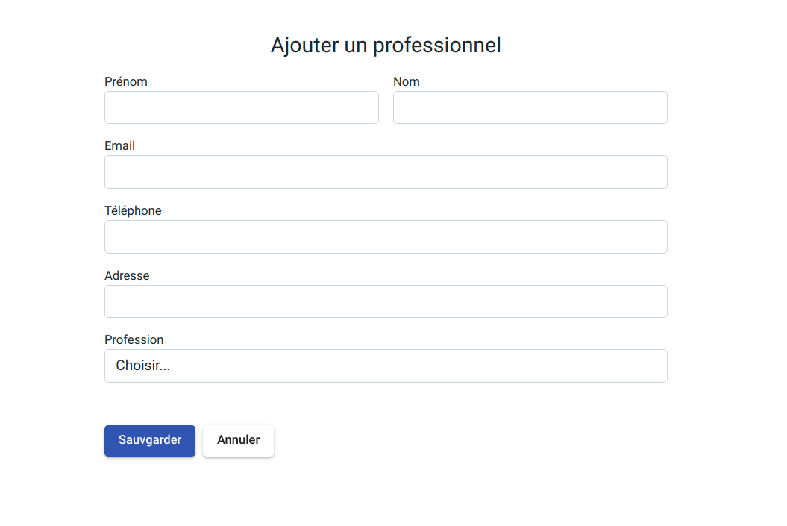
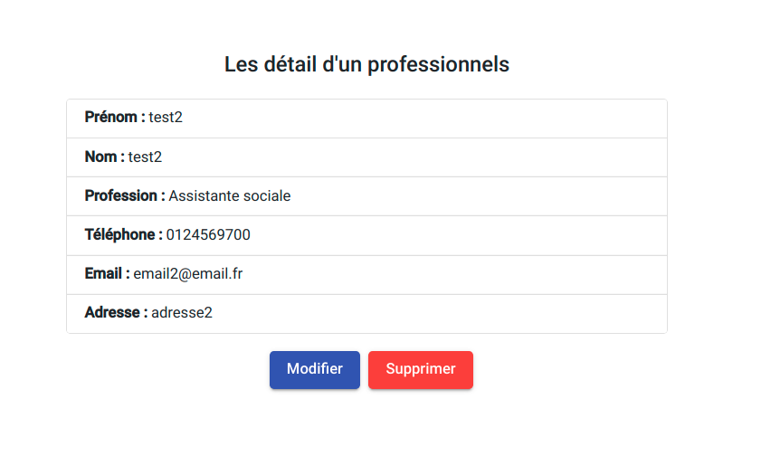

# MoveinmedFront

MoveInMedFront est une application front-end pour [L'API REST](https://github.com/jonasmelheb/moveinmed.git)  pour gérer les professionnels.

## Environnement de développement

### Pré-requis

* Angular 12
* Angular CLI

### Installation

```bash
# Cloner le repository
git clone https://github.com/jonasmelheb/moveinmed-front.git
# Entrer dans le directory
cd moveinmed-front/
# Installer les dépendance
npm i 
# Lancer l'application
ng serve
```
* Le projet est lancé sur http://localhost:4200/
### Structure du projet

```
├── package.json
├── package-lock.json
├── README.md
├── src
│   ├── app
│   │   ├── app.component.css
│   │   ├── app.component.html
│   │   ├── app.component.ts
│   │   ├── app.module.ts
│   │   ├── app.routes.ts
│   │   ├── recources
│   │   │   └── professionals
│   │   │       ├── add-professional
│   │   │       ├── professional-list
│   │   │       ├── professional-detail
│   │   │       └── search-result
│   │   │       
│   │   ├── partials
│   │   │   └── hearder
│   │   │       └── navbar
│   │   └── common
│   │       ├─── interface
│   │       └──  services
│   ├── favicon.ico
│   ├── index.html
│   ├── main.ts
│   ├── polyfills.ts
│   └── styles.css
```

### Liste des professionnels



### Ajouter un professionnel



### Les détails d'un professionnel


